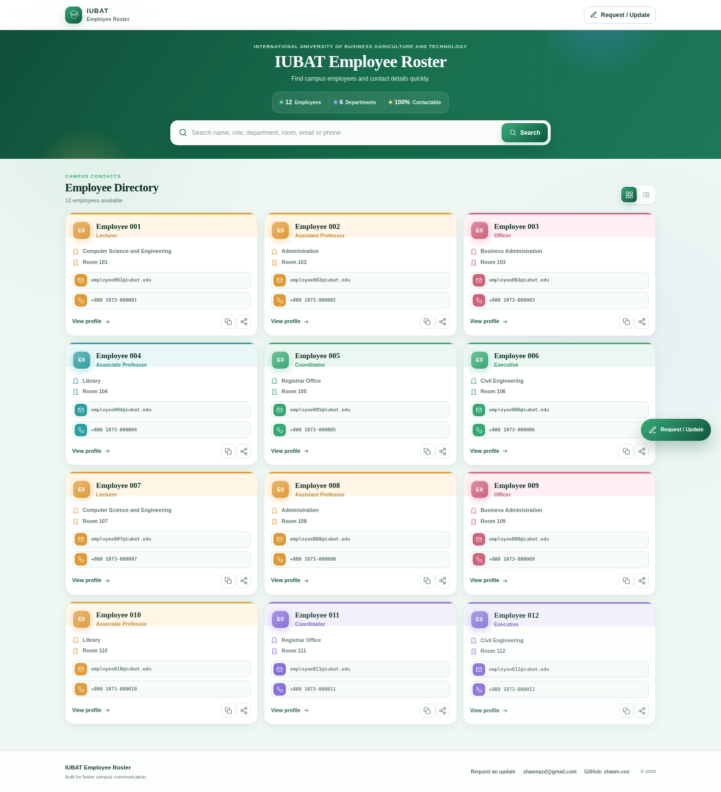
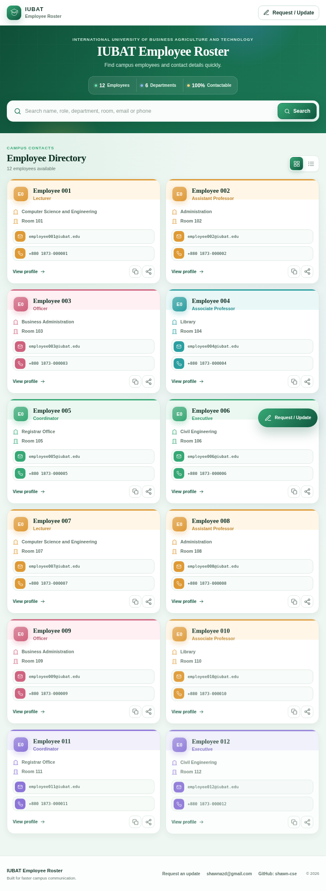
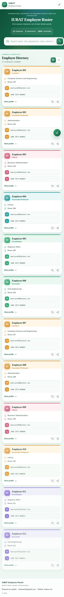

# IUBAT Employee Roster

A colorful, compact, and fully responsive employee directory for the International University of Business Agriculture and Technology (IUBAT). This edition preserves the original card-based identity and practical contact actions while adding faster search, accessibility, data resilience, and responsive behavior.

## Project owner

- **GitHub:** [shawn-cse](https://github.com/shawn-cse)
- **Email:** [shawnazd@gmail.com](mailto:shawnazd@gmail.com)
- **Repository:** `https://github.com/shawn-cse/iubat-employee`
- **GitHub Pages:** `https://shawn-cse.github.io/iubat-employee/`

## Screenshots

### Desktop



### Tablet



### Mobile



## Design improvements

- Compact card sizing with more employees visible on screen
- Color-coded card accents for a lively but consistent visual system
- Original green IUBAT identity retained
- Elegant Fraunces headings with readable Plus Jakarta Sans body text
- Compact search, stats, buttons, and contact rows
- Responsive three-column, two-column, and one-column layouts
- Proper list view for fast scanning
- Clear hover states and native `title` text on important controls
- Accessible custom tooltips for icon actions
- Mobile bottom-sheet dialogs and compact floating update button
- Reduced-motion support

## Functionality

- Instant employee search by name, designation, department, room, email, or phone
- Pre-indexed search text and render-once cards for smooth typing and deletion
- Grid and list views with saved view preference
- Employee profile dialog
- Email and tap-to-call actions
- Copy employee details
- Native share with clipboard fallback
- Request/update dialog with email, Facebook, and WhatsApp
- Loading skeletons
- Empty, retry, and error states
- Cached data fallback when the live database is temporarily unavailable
- Instant search clearing
- Back-to-top control
- Keyboard-accessible dialogs with focus trapping and Escape-to-close

## Project structure

```text
iubat-employee/
├── frontend/
│   ├── assets/
│   │   └── favicon.svg
│   ├── css/
│   │   └── styles.css
│   ├── js/
│   │   ├── app.js
│   │   └── config.js
│   └── index.html
├── screenshots/
│   ├── desktop-roster.png
│   ├── tablet-roster.png
│   └── mobile-roster.png
├── .gitignore
├── index.html
├── LICENSE
└── README.md
```

## Frontend and backend

This repository contains a static frontend in `frontend/`. It does not contain a custom Node.js, PHP, Python, or Java server.

Supabase provides the hosted database and REST backend. The frontend reads employee records directly using the public Supabase publishable/anon key. Protect all write operations with Supabase Row Level Security policies.

## Run locally

### Easiest option: VS Code Live Server

1. Extract the ZIP.
2. Open the complete project folder in VS Code.
3. Install the **Live Server** extension.
4. Open `frontend/index.html`.
5. Select **Open with Live Server**.

### Python local server

Open a terminal in the project root:

```bash
python -m http.server 8000
```

Then visit:

```text
http://localhost:8000
```

The root page redirects automatically to `frontend/`.

You may also run directly from the frontend folder:

```bash
cd frontend
python -m http.server 8000
```

## Supabase configuration

Configuration is stored in:

```text
frontend/js/config.js
```

Expected structure:

```js
window.APP_CONFIG = Object.freeze({
  SUPABASE_URL: "YOUR_SUPABASE_URL",
  SUPABASE_KEY: "YOUR_PUBLISHABLE_ANON_KEY",
  TABLE_NAME: "Employee",
  CACHE_KEY: "iubat_employee_directory_cache_v2",
  CACHE_MAX_AGE_MS: 24 * 60 * 60 * 1000,
  CONTACT: Object.freeze({
    email: "shawnazd@gmail.com",
    facebook: "https://facebook.com/shawnazd",
    whatsapp: "https://wa.me/8801873319733",
  }),
});
```

### Expected table columns

| Website field | Supabase column |
|---|---|
| Name | `Name` |
| Designation | `Designation` |
| Department or office | `Department/Office` |
| Room | `Room` |
| Email | `Email` |
| Phone | `Cell` |

Example table:

```sql
create table "Employee" (
  id bigint generated by default as identity primary key,
  "Name" text,
  "Designation" text,
  "Department/Office" text,
  "Room" text,
  "Email" text,
  "Cell" text
);
```

Example public read policy:

```sql
alter table "Employee" enable row level security;

create policy "Allow public employee reads"
on "Employee"
for select
to anon
using (true);
```

Do not put a Supabase service-role key or another private secret in frontend code.

## Upload to GitHub

Create or open the `iubat-employee` repository under the **shawn-cse** account, then run:

```bash
git init
git add .
git commit -m "Improve colorful compact employee roster"
git branch -M main
git remote add origin https://github.com/shawn-cse/iubat-employee.git
git push -u origin main
```

When the repository already has a remote, use:

```bash
git remote set-url origin https://github.com/shawn-cse/iubat-employee.git
git push -u origin main
```

## Deploy free with GitHub Pages

1. Upload the complete project to GitHub.
2. Open the repository **Settings**.
3. Open **Pages**.
4. Select **Deploy from a branch**.
5. Choose the `main` branch and `/root` folder.
6. Save.

The root `index.html` redirects to the website inside `frontend/`.

## Testing checklist

- Desktop, tablet, and mobile layout
- No horizontal page overflow
- Search while typing and clear search
- Grid and list views
- Profile dialog
- Request/update dialog
- Copy and share actions
- Email and phone links
- Keyboard focus and Escape closing
- Loading, empty, error, retry, and cache states
- JavaScript syntax

The live Supabase connection must be verified after deployment because availability also depends on the Supabase project, table, and RLS policy.

## License

Released under the MIT License. See [LICENSE](LICENSE).
